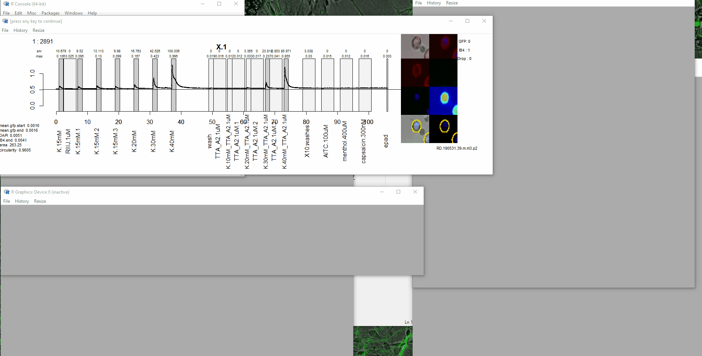
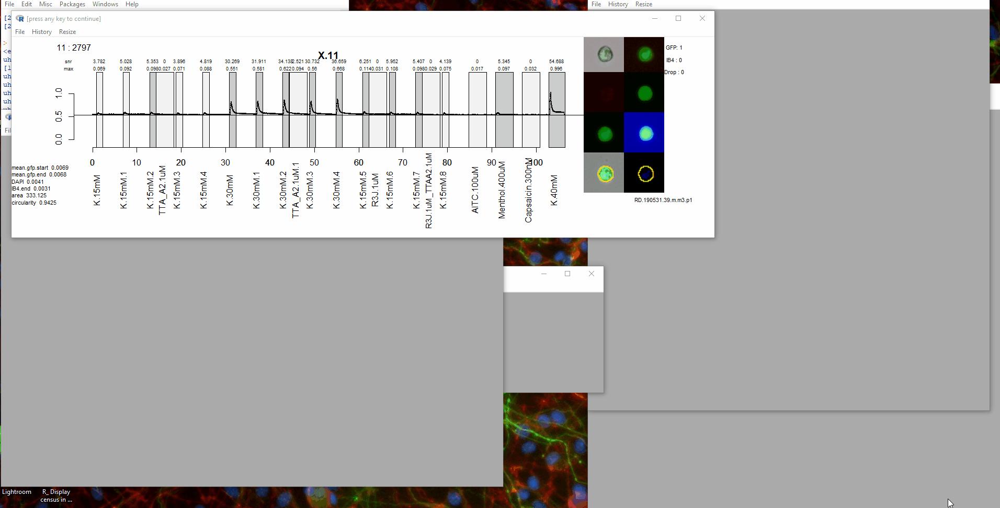

# traceClick.dev
This is an interactive visualization, which is constantly under development (thus the dev). In general to use the function follow,

## Loading experiment data
Loading the experiment is as easy as double clicking the `RD.experiment.Rdata1` within the folder. Performing this action with automatically set the correct working directory.

If you would like to circumvent this, it is essential you set the correct working directory, then load the `RD.experiment.Rdata`. Below is an example, after opening the R console, or an R terminal.
```
# Load in the package
require(procPharm)

# Set the working directory (this is where the experiment is located)
# If you have downloaded the experiment from the paper, check the download folder.
setwd("Y:/Lee Leavitt/Presentations/Paper/Figures/TTA A2 Dose Response/190531.39.m.m3.p2 ttaa2 potassium dose response comparison/")

# Load the experiment. 
load("./RD.190531.39.m.m3.p2.Rdata")
```
For an overview of the composition of the experiment data, go [here](../../extras/Documentation/RDcomp.md).

## tcd
Now that both the software and the experiment data is loaded invoking the `tcd()` function. This function has flexible inputs and many features to use during visualization as well as analysis tasks.

Most consoles are interactive. To view what has populated the current work space us the `ls()` function. The output of this function will show the experiment name. 
```
ls()
```
prior to using tcd familiarize yourself with the controls
```R
?tcd

```


To enter the experiment for visualization, (the gif shows the initial view entering the visualization),
```
tcd(RD.190531.39.m.m3.p2)
```


## Main controls
<kbd>up</kbd>: Moves through current selected list of cell

<kbd>down</kbd>: Moves down through selected list of cells

<kbd>1-9, -, =</kbd>: Collect cells into groups 1-12

<kbd>o</kbd> Order traces in single view based on **c.dat**, **bin**, **scp**. For information on these data frames please go [here](./RDcomp.md)

<kbd>F7</kbd>: Populate the groups with the cell_types

<kbd>shift</kbd><kbd>p</kbd>: Select group of cells to populate the groups

<kbd>s</kbd>: Stack all cells from the selected group

<kbd>shift</kbd><kbd>s</kbd>: Sample stack selected group. Usefule if selected group has more than 50 cells.



## Cell View

Additionally the cells can be viewed using,

<kbd>v</kbd> View the cells from the selected group

<kbd>shift</kbd><kbd>i</kbd> Change the image for the multi-view and the single-view images. Only one image can be selected here.

<kbd>i</kbd> select the image to display next to the stacked traces. Can be multiple


## Advanced Trace view

Visualizing traces has many more options.

<kbd>t</kbd> select the type of trace to view

<kbd>h</kbd> select the color of the trace

<kbd>shift</kbd><kbd>d</kbd> Change the separation of the traces **< 1** closer together **> 1** further apart

<kbd>shift</kbd><kbd>o</kbd> Sort the traces on a continuous selected variable.

<kbd>r</kbd> Rename a selected group to what you would like.

<kbd>shift</kbd><kbd>v</kbd> Select the values to appear on the right side of the trace.

<kbd>u</kbd> Underline toggle for both stacked traces and single trace view

<kbd>l</kbd> Select the window regions to display. Any or all can be observed.

In the example below,
   * A new group is chosen using <kbd>shift</kbd><kbd>p</kbd>
   * The baseline corrected trace is selected <kbd>t</kbd>
   * The color of the trace is selected <kbd>h</kbd>
   * The underline is removed <kbd>u</kbd>
   * The traces are squished closer together <kbd>shift</kbd><kbd>d</kbd>
   * More values are added to the right of trace using <kbd>shift</kbd><kbd>v</kbd>
   
   

## Cell Group function

One of the main functionalities of this software is to create groups. Combined with the custom statistics below, rapidly identifying cells pertaining to a specific response type is easy.

Pressing any of these buttons will places cells into groups 1 through 12.

<kbd>1,2,3,4,5,6,7,8,9,0,-,=</kbd>

Pressing any of these keys will remove neurons from groups 1 through 12.

<kbd> !, @, #, $, %, ^, &, *, (, ), _, + </kbd>

<kbd>r</kbd> Rename: Groups are generically named `g.names#`. These names are uninformative. So, to changes these names pressing <kbd>r</kbd> will first ask which group to rename. Then the console will ask for the new name. 

<kbd>m</kbd> Following the custom statistics and box-plot localization, cells are placed in `g.names12` or simply the 12th group regardless of the current composition of the group. So to move the new group into a better location pressing <kbd>m</kbd> will move the cells to the newly specified group.

Importantly, on a rare occassion `tcd` will crash. This function has an `BACKUP` object created very often during the time spent in tcd. To resume from where you left off simply perform this,

````
tcd(RD.experiment, BACKUP)
````

To leace tcd press <kbd>q</kbd>. A question will prompt asking "*Would you like yo save your groups*". 
  
  * No, the groups will not be saved to the hard disk. 
  * Yes, the groups will be saved as the name specified.

  


## Custom Statistics
Sorting traces based on non obvious characteristics is important. To capture these characteristics two functions have been created to make these statistics. These functions are encapsulated in the F1 and F2 key.

### <kbd>F1</kbd> Custom Statistic
    
This function allows you to select various window regions to create a ratio. During the experiments we apply compounds which elicit amplification, block, or direct effects. Rapidly sorting the traces based on these effects is paramount for a rapid analysis. 

The function additionally has a "boxPlotSelector" functionality. This means. one can use a box plot to select cells based on the new statistic. 

The user has the option to save the statistic. This appends the newly created statistic to the end of the **scp** data frame with the user input name. Once this statistic is saved the user has the option of sorting cells based on this stat. 

Before starting this function, the cells currently selected will be the cells sent into this function. Meaning the output of this function is completely dependent on the input to this function.

The workflow of this functionality is,
    
  1. Select the statistic to observe. For a description of these stats, please refer [here](../../extras/Documentation/RDcomp.md)
  2. Select the control window region. This can be multiple and this will be the mean of these values
  3. Select the active window. Once again multiple windows can be selected during this time.
  4. Save the statistic? This option will allow you to add this stat to the scp.
  5. Make a new stat? Here you can go immediately to creating another statistic immediately
  6. Localize boxplot? This functionality allows you to subset the cells based on the box/density plot.
      
        1. The **one** option will return all cells above the click
        2. The **two** option will return cell between the clicks. This helps to localize cell based on the statistic.

Once complete the selected cells are now sorted based on this statistic and placed within the 12th group. To Select these cells press <kbd>shift</kbd><kbd>p</kbd>, and then select **g.names12** or the twelfth group regardless of the name. 

Moving groups is also easy now. To move the group press <kbd>m</kbd>. The first question is, which group to move. The second question is the new group to move it to. This will over write the group.



### <kbd>F2</kbd> Min max normalization statistic

This statistic follows closely what the F1 custom statistic does. The difference is only two windows are compare and a min max normalization is performed. This statistic creates a range between -1 and 1. Placing everythin within this range prevents missing out on extreme outliers. **This function does not require clicking the `stop locator` at the top left. 
    
    (Red + Blue) / (Red - Blue)

The general work flow of this example is
  
  1. Find a representation of what I am looking for. Here I choose a neuron amplified by the compound R3J. 
  2. Fill in all the group with cell_types by pressing <kbd>F7</kbd>
  3. From there i select the window following the R3J application.
  4. The window following the R3J is now selected.
  5. Now the newly created stat is saved. With a Unique name. 
  6. Making a new stat is skipped.
  7. Localizing the box plot is invoked. The one method is selected and only the cells greater than the statistic are returned. These cell are placed into the 12th group, and sorted by the statistic.
  8. To show this newly created statistic we sort the cells by this new stat, pressing <kbd>o</kbd>.


 
